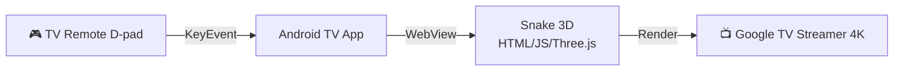

# Snake 3D — Android TV App (Native Install)

## Tổng quan

Tạo Android TV app wrap game Snake 3D hiện tại trong **WebView**. User cài trực tiếp từ **Google Play Store** trên Google TV Streamer 4K. Game điều khiển bằng remote TV (D-pad → arrow keys → WebView).



## User Review Required

> [!IMPORTANT]
> **Để publish lên Google Play Store, bạn cần:**
> - Tài khoản **Google Play Developer** ($25 one-time fee)
> - Đăng ký tại [play.google.com/console](https://play.google.com/console)
> - Cần **Android Studio** để build APK (hoặc mình tạo project, bạn build)

> [!WARNING]
> **Cast Receiver code** ([cast-receiver.js](file:///Users/lamle/Development/github/goriant/google-tv-snake-3D/js/cast-receiver.js), [sender.html](file:///Users/lamle/Development/github/goriant/google-tv-snake-3D/sender.html), [sender.js](file:///Users/lamle/Development/github/goriant/google-tv-snake-3D/js/sender.js), [sender.css](file:///Users/lamle/Development/github/goriant/google-tv-snake-3D/css/sender.css)) sẽ **giữ nguyên** trong repo nhưng không cần cho Android TV app. WebView sẽ load [index.html](file:///Users/lamle/Development/github/goriant/google-tv-snake-3D/index.html) trực tiếp → game chạy bằng remote D-pad, không cần phone sender.

## Proposed Changes

### 1. Android TV Project

#### [NEW] `android/` folder — Android TV project
Tạo Android project structure:

```
android/
├── app/
│   ├── src/main/
│   │   ├── java/com/goriant/snake3d/
│   │   │   └── MainActivity.kt        # WebView fullscreen activity
│   │   ├── res/
│   │   │   ├── drawable-xhdpi/
│   │   │   │   └── app_banner.png      # TV banner 320x180
│   │   │   ├── mipmap-xxxhdpi/
│   │   │   │   └── ic_launcher.png     # App icon
│   │   │   ├── layout/
│   │   │   │   └── activity_main.xml   # WebView layout
│   │   │   └── values/
│   │   │       ├── strings.xml
│   │   │       └── styles.xml          # Fullscreen no-title theme
│   │   ├── assets/
│   │   │   └── www/                    # ← Copy toàn bộ web game vào đây
│   │   │       ├── index.html
│   │   │       ├── css/
│   │   │       └── js/
│   │   └── AndroidManifest.xml         # TV-specific config
│   └── build.gradle.kts
├── build.gradle.kts
├── settings.gradle.kts
└── gradle/
```

### 2. Key Files

#### [NEW] `MainActivity.kt`
- Fullscreen WebView load `file:///android_asset/www/index.html`
- Enable JavaScript, WebGL, hardware acceleration
- Override D-pad key events → inject vào WebView
- Disable over-scroll (no bounce effect)
- Handle back button → exit confirm

#### [NEW] `AndroidManifest.xml`
```xml
<uses-feature android:name="android.software.leanback" android:required="true" />
<uses-feature android:name="android.hardware.touchscreen" android:required="false" />
<application android:isGame="true" android:banner="@drawable/app_banner">
```

#### [NEW] `activity_main.xml`
- Single `WebView` chiếm full screen
- `match_parent` width & height

### 3. Assets

#### [NEW] TV Banner (`app_banner.png`)
- 320×180 px, neon theme, text "SNAKE 3D"
- Hiện lên trên home screen Android TV

#### [NEW] App Icon (`ic_launcher.png`)
- 512×512 cho Play Store
- Matching neon theme

## Verification Plan

### Local Testing
1. Build APK trong Android Studio
2. Install qua ADB: `adb install app-debug.apk`
3. Test trên Google TV Streamer 4K
4. Verify: D-pad navigation, game render, audio

### Play Store Publishing
1. Build release APK/AAB (signed)
2. Upload lên Google Play Console
3. Fill store listing (screenshots, description)
4. Submit for review
